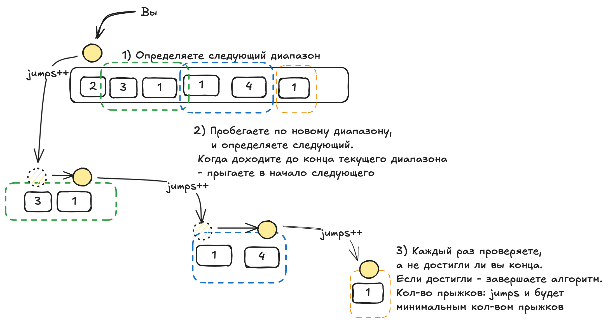

## Минимальное кол-во прыжков чтоб добраться до вершины лестницы
[ссылка на leetcode](https://leetcode.com/problems/jump-game-ii/description/?envType=study-plan-v2&envId=top-interview-150)

## Решение через dynamic programming

Надо найти `minJ(N - 1)` - минимальное кол-во прыжков, чтобы добраться до `nums[N - 1]`

### 1. Находим оптимальную подструктуру
   Если для каждого `i = [0, 1, ..., j - 1]` знаем `minJ(i)`, как узнать `minJ(j)`?
```
minJ(j) = min(
    P[j - 1] + minJ(j - 1),
    P[j - 2] + minJ(j - 2),
    P[j - 3] + minJ(j - 3), 
     ...,
    P[0] + minJ(0)
)
где P[k] = { Inf: nums[k] < (j - k);
            (j - k): nums[k] >= (j - k);
            0: k == 0
          }
```

### 2. Это можно выразить формулой:
```
minJ(n - 1) = min by i (P[i] + minJ(i)), i = [0, .. , n - 2]
```

### 3. Строим таблицу db:
```
dp[0] = 0;
dp[i] = min(dp[i], dp[j] + (nums[j] >= (i - j) ? 1 : Inf)) for j = 1..i-1
```

## Решение с линейной сложностью
Рассматриваем не лестницы, а диапазоны, куда можнем прыгнуть.  
Например: `[2,3,1,1,4,1]` . 
- с `[2]` можем прыгнуть на `[3, 1]`. Это стал текущий диапазон.
- идем по `[3, 1]` и смотрим следующий диапазон -> `[1, 4]`
- идем по `[1, 1, 4]` и смотрим следующий диапазон -> `[1]`. А это уже конец.

Важно: каждый новый диапазон начинать сначала, чтобы не пропустить самый большой прыжок.  

По сути первый элемент - это и есть начальный диапазон.  
Следующий диапазон - всегда: `[второй элемент -> дальний элемент, до которого возможно допрыгнуть с первого]`
Перед заходом в начало нового диапазона запоминаете его конец (дальний элемент).  
Проходитесь по новому диапазону, и смотрите, куда дальше всего можно прыгнуть. Это и будет конец следующего диапазона.  
А начало следующего диапазона - это конец предыдущего + 1.  
Но явно запоминать начало диапазона не нужно.  
Просто итерируемся по элементам последовательно, и увеличиваем jumps, когда пересекаем конец диапазона.

```
minJumps(nums): int
    curEnd = 0
    farthest = 0
    jumps = 0;
    
    for i in 0..n-1:
        farthest = max(farthest, i + nums[i])
        if i == curEnd:
            jumps++;
            curEnd = farthest;

    ret jumps;
```

